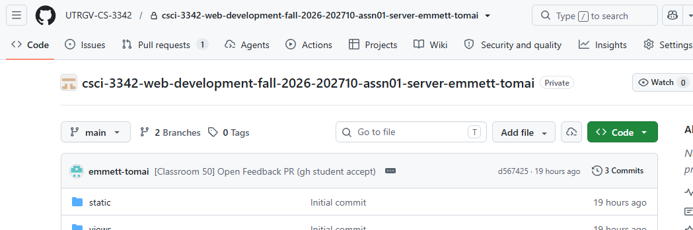
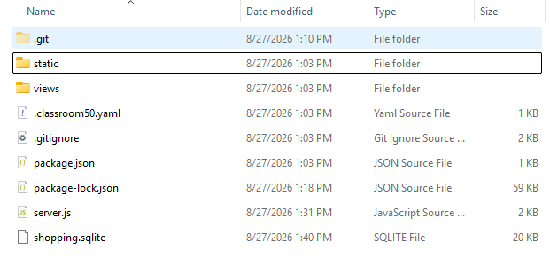
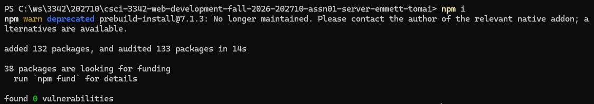
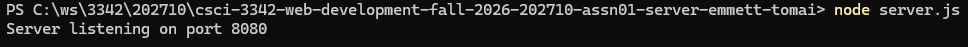
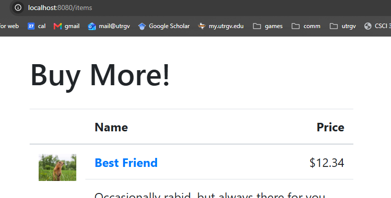
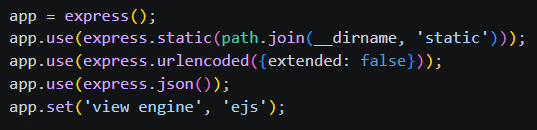

# Preliminaries

## git and a GitHub account

I noticed that the prior course page I gave before to set up git/github had some extra, unnecessary things from that semester. Here is a better reference:

https://faculty.utrgv.edu/emmett.tomai/courses/3342-202520/01_html/assn3.html

## Install a code editor

vscode is the standard choice these days and what I'll be using in class. You can use any editor of course.

## Choose your browser

I'll be using chrome in class. Any browser is fine.

# Assignment

## Accept invite and clone

Every assignment will be distributed and submitted via git, just like all software development is done. You'll get an *invite* link each time that copies the starting repo for you.

invite: https://classroom50.org/UTRGV-CS-3342/csci-3342-web-development-fall-2026/assignments/202710-assn01-server/accept

Accept and it will create and take you to your copy of the starting repo.

Clone the repo to a nice clean folder where you work for this class. I don't recommend putting your git repos in a OneDrive folder. They don't play well and are redundant.

## Project setup

In the project directory, install the dependencies using `npm`.

`npm i` installs all the modules specified in `package.json`. they are installed locally in the project directory in a directory called `node_modules` which makes the project portable.

The `.gitignore` tells git what files to never add to the repo. Very important to always have one of these since `node_modules` now has nearly 2000 files installed.

(optional): I recommend installing the `nodemon` package which restarts the server when the `server.js` file changes. instructions here: https://www.npmjs.com/package/nodemon

Run the webserver and view it at [http://localhost:8080/items](http://localhost:8080/items). (Again, installing and using `nodemon` instead of plain `node` here is recommended.)

## The Web Site

In class we quickly surveyed a standard, basic dynamic website written in javascript/node/express. It has the most common website functionality:

* Read items from a database and show them on a page (the `item` route)
* Click on any item to see a details page for that item (the `item_view` route)
* `POST` a form to add something (a review)

*Always make sure the code I give you does what it's supposed to before you move on.*

`server.js` creates and configures an `express` instance, a database connection, and defines the three routes.

* `express` is a lightweight modular web server. Additional functionality is added explicitly. The lines below configure static files, receiving POST data, and HTML templating with EJS.

* The `static` directory holds files that are servered as-is. You can configure a different static folder when enabling the static module with app.use.
* The `views` directory holds `EJS` templates. Templating is the standard server-side way to dynamically generate HTML. Most of the template is plain HTML, making it easy to write and maintain. Special characters (`<% %>`) are used to invoke the code interpreter and insert dynamic content.
* `shopping.sqlite` is an SQLite database. SQLite is a driver that talks SQL to a simple file so that you don't have to setup a db server.

To view and manually change the dataabse, download this free tool:

https://sqlitebrowser.org/

**You must click the `Write Changes` button at the top after any change to write to the file.**

# Assignment

As I said, this is the simple functionality that most dynamic websites need. Show data from a database, let the user click through, and let the user send back form information. It could be prettied up with sorting and searching and mouseover info tips and all that.

This assignment is very open by design. The main point is for you to explore this example site. The goal of any upper-division CS class is not to teach your technology X. As a Computer Scientist, you want to be able to engage with an unfamiliar system and "get it".

That doesn't mean that you know all the syntax or details, but you can see what's going on because it uses the same concepts and techniques as every other language, environment, and project. You can see what's different and interesting in this language, environment, and project. And you can, if need be, make logical modifications to try out different functionality.

Use the example site to create a different dynamic website. Try to go beyond just re-skinning the exact same routes and pages. This is an **AI enabled** assignment. Any simple AI web interface will do, if you don't have an AI dev setup. Decide what changes you want to make, break that down into features, and then have the AI advise you on how to create those new features using the examples already there. What you turn in should not be some completely different code. It should be a new site made with the same code architecture as the example.

* You can edit the website in place or make a new subdir for your work
* `commit` and `push` every time you do some work
* whatever has been pushed at the deadline is your submission
* we'll take a look at everyone's websites in class on Tue

# Reference

The lessons from the previous class on HTML, CSS, JavaScript, Server-Side HTML, and Database/SQL are here. Many have videos, which should be accessible. You may need to login to Brightspace first in order to see them.

https://faculty.utrgv.edu/emmett.tomai/courses/3342-202520/index.html

One notable JavaScript language feature is asynchronous execution with `async`/`await`. You can look that up, ask AI about it, or check out the prior class video here about database access that talks about how we're using it in database calls.

https://faculty.utrgv.edu/emmett.tomai/courses/3342-202520/04_db/03-interface.html
